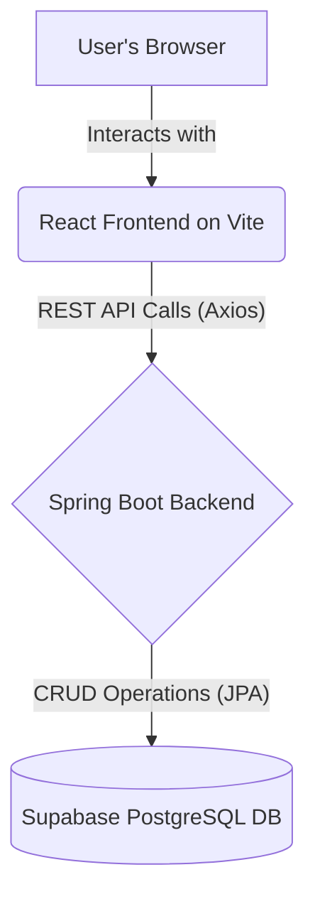

# Lost & Found Portal


A full-stack, production-grade platform for reporting and managing lost and found items. The system features a public submission form, a moderator approval workflow, and a public listing of approved items.

---

## Table of Contents

1.  [Project Overview](#1-project-overview)
    -   [1.1. Scenario](#11-scenario)
    -   [1.2. Core Features](#12-core-features)
2.  [Technology Stack & Architecture](#2-technology-stack--architecture)
    -   [2.1. Tech Stack](#21-tech-stack)
    -   [2.2. System Architecture](#22-system-architecture)
3.  [Software Development Lifecycle (SDLC)](#3-software-development-lifecycle-sdlc)
4.  [Getting Started](#4-getting-started)
    -   [4.1. Prerequisites](#41-prerequisites)
    -   [4.2. Database Setup (Supabase)](#42-database-setup-supabase)
    -   [4.3. Environment Configuration](#43-environment-configuration)
5.  [Local Development Setup](#5-local-development-setup)
    -   [5.1. Backend (Java + Spring Boot)](#51-backend-java--spring-boot)
    -   [5.2. Frontend (React + Vite)](#52-frontend-react--vite)
6.  [Running the Application](#6-running-the-application)
7.  [API Documentation](#7-api-documentation)
8.  [Database Schema](#8-database-schema)
9.  [Deployment Strategy](#9-deployment-strategy)
10. [Future Roadmap](#10-future-roadmap)
11. [Contributing](#11-contributing)
12. [License](#12-license)

---

## 1. Project Overview

### 1.1. Scenario

This project aims to build a robust system for reporting and tracking lost and found items. To maintain the quality and safety of the listings, all user submissions must first be approved by a moderator before they are made public. Once an item is found, a user can claim it, which updates its status and notifies the relevant parties.

### 1.2. Core Features

-   **CRUD Operations:** Full capabilities for creating, reading, updating, and deleting lost/found item reports.
-   **Approval Workflow:** Items submitted by users enter a `Pending Approval` state.
-   **Moderator Dashboard:** A dedicated interface for moderators to review and `Approve` or `Reject` submissions.
-   **Public Listings:** An aggregated, public-facing view of all `Approved` items.
-   **Item Claim System:** Functionality for users to claim a found item, changing its status to `Claimed`.

## 2. Technology Stack & Architecture

### 2.1. Tech Stack

| Area      | Technology                                    | Description                                     |
| :-------- | :-------------------------------------------- | :---------------------------------------------- |
| **Backend** | **Java 17** + **Spring Boot**                 | For building robust, scalable RESTful APIs.     |
|           | **Spring Data JPA / Hibernate**               | For data persistence and ORM.                   |
|           | **Maven**                                     | For dependency management and project build.    |
| **Frontend**| **React 18** (**Vite**)                       | For building a fast, modern user interface.     |
|           | **Axios**                                     | For making HTTP requests to the backend.        |
|           | **React Router**                              | For client-side routing and navigation.         |
| **Database**| **Supabase** (**PostgreSQL**)                 | Backend-as-a-Service providing a managed DB and APIs. |

### 2.2. System Architecture

The application follows a classic client-server architecture. The React frontend is the presentation layer, which communicates with the Spring Boot backend via a REST API. The backend handles all business logic and interacts with the Supabase PostgreSQL database for data persistence.



## 3. Software Development Lifecycle (SDLC)

This project adopts an **Agile, iterative development model**. Given the rapid timeline, development is structured feature-by-feature, ensuring that a testable, end-to-end slice of functionality is completed in each cycle.

-   **Planning:** High-level requirements and architecture were defined at the outset.
-   **Development:** Backend and frontend development occur in parallel.
-   **Integration:** Continuous integration between the frontend and backend at each feature completion.
-   **Testing:** Manual end-to-end testing is performed after each feature is integrated.
-   **Deployment:** The plan includes deploying a Minimum Viable Product (MVP) quickly to gather user feedback.

## 4. Getting Started

### 4.1. Prerequisites

Ensure you have the following installed on your local machine:
-   **Java Development Kit (JDK)**: Version 17 or newer
-   **Apache Maven**: Version 3.8 or newer
-   **Node.js**: Version 18.x or newer (with npm)
-   **Git**: For version control
-   **IDE**: IntelliJ IDEA (recommended for Spring) or VS Code
-   **Supabase Account**: A free account at [supabase.com](https://supabase.com).

### 4.2. Database Setup (Supabase)

1.  Create a new project in your Supabase dashboard.
2.  Navigate to the **SQL Editor**.
3.  Run the following script to create the `items` table:
    ```sql
    CREATE TABLE items (
        id UUID PRIMARY KEY DEFAULT gen_random_uuid(),
        created_at TIMESTAMPTZ DEFAULT now() NOT NULL,
        title TEXT NOT NULL,
        description TEXT NOT NULL,
        reporter_email TEXT,
        status TEXT DEFAULT 'pending_approval' NOT NULL,
        claimant_id TEXT
    );
    ```
4.  Navigate to **Authentication -> Policies** and **Enable RLS** (Row Level Security) on the `items` table. We will add policies later.

### 4.3. Environment Configuration

You will need to create environment files for both the backend and frontend to store your Supabase credentials securely. **Do not commit these files to Git.**

#### Backend (`lostandfound/.env`)

Create a `.env` file in the root of the `lostandfound` directory.
```env
SPRING_DATASOURCE_URL="jdbc:postgresql://db.<your-ref-id>.supabase.co:5432/postgres"
SPRING_DATASOURCE_USERNAME="postgres"
SPRING_DATASOURCE_PASSWORD="<your_supabase_db_password>"

SUPABASE_URL="https://<your-ref-id>.supabase.co"
SUPABASE_ANON_KEY="<your_supabase_anon_key>"
SUPABASE_SERVICE_ROLE_KEY="<your_supabase_service_role_key>"
```

#### Frontend (`frontend/.env.local`)

Create a `.env.local` file in the root of the `frontend` directory.
```env
VITE_SUPABASE_URL="https://<your-ref-id>.supabase.co"
VITE_SUPABASE_ANON_KEY="<your_supabase_anon_key>"
```

## 5. Local Development Setup

First, clone the repository:
```bash
git clone <your-repository-url>
cd <repository-folder>
```

### 5.1. Backend (Java + Spring Boot)

1.  Open the `lostandfound` directory in your IDE (e.g., IntelliJ IDEA).
2.  Your IDE should automatically detect it as a Maven project and download the required dependencies.
3.  If you are using IntelliJ, install the **"EnvFile"** plugin to read the `.env` file. Edit your run configuration and enable it.
4.  The application will be ready to run.

### 5.2. Frontend (React + Vite)

1.  Navigate to the frontend directory in your terminal:
    ```bash
    cd frontend
    ```
2.  Install all the required npm packages:
    ```bash
    npm install
    ```

## 6. Running the Application

-   **To run the Backend:**
    -   Start the `LostandfoundApplication` main class from your IDE.
    -   The server will start on `http://localhost:8080`.

-   **To run the Frontend:**
    -   In the `frontend` directory, run:
      ```bash
      npm run dev
      ```
    -   The application will be available at `http://localhost:5173`.

## 7. API Documentation

The backend exposes the following REST endpoints.

### Create a New Item

-   **Endpoint:** `POST /api/items`
-   **Description:** Submits a new lost or found item for moderator approval.
-   **Request Body:**
    ```json
    {
      "title": "Lost Black Wallet",
      "description": "Lost a black leather wallet near the central library. Contains ID and credit cards.",
      "reporterEmail": "user@example.com"
    }
    ```
-   **Response (201 CREATED):**
    ```json
    {
      "id": "a1b2c3d4-e5f6-...",
      "createdAt": "2025-10-04T18:00:00.000Z",
      "title": "Lost Black Wallet",
      "description": "...",
      "reporterEmail": "user@example.com",
      "status": "pending_approval",
      "claimantId": null
    }
    ```

_(This section will be updated as more endpoints are added.)_

## 8. Database Schema

### `items` Table

| Column Name     | Data Type    | Constraints                               | Description                                      |
| :-------------- | :----------- | :---------------------------------------- | :----------------------------------------------- |
| `id`            | `UUID`       | **Primary Key**, `default: gen_random_uuid()` | Unique identifier for each item.                 |
| `created_at`    | `TIMESTAMPTZ`| **Not Null**, `default: now()`            | Timestamp of when the report was created.        |
| `title`         | `TEXT`       | **Not Null**                              | The title of the item listing.                   |
| `description`   | `TEXT`       | **Not Null**                              | A detailed description of the item.              |
| `reporter_email`| `TEXT`       |                                           | Email of the person who reported the item.       |
| `status`        | `TEXT`       | **Not Null**, `default: pending_approval` | Current state: `pending_approval`, `approved`, `claimed`. |
| `claimant_id`   | `TEXT`       |                                           | Identifier (e.g., email) of the person who claimed it. |

## 9. Deployment Strategy

-   **Frontend (React)**: The frontend application is static and can be deployed to a service like **Vercel** or **Netlify**. Deployment is automated via Git pushes to the `main` branch.
-   **Backend (Spring Boot)**: The backend is a stateful application that can be containerized using **Docker** and deployed to a cloud provider like **AWS (Elastic Beanstalk)**, **Heroku**, or **Google Cloud Run**.

## 10. Future Roadmap

-   [ ] **User Authentication:** Full user accounts for moderators and reporters.
-   [ ] **Image Uploads:** Allow users to upload images of the items.
-   [ ] **Real-time Notifications:** Email or in-app notifications for status changes.
-   [ ] **Search and Filtering:** Advanced search functionality for the public listings page.
-   [ ] **Automated Testing:** Implement unit and integration tests for the backend.

## 11. Contributing

Contributions are welcome! Please fork the repository and create a pull request with your changes. For major changes, please open an issue first to discuss what you would like to change.

## 12. License

This project is licensed under the MIT License. See the [LICENSE](LICENSE) file for details.

```
